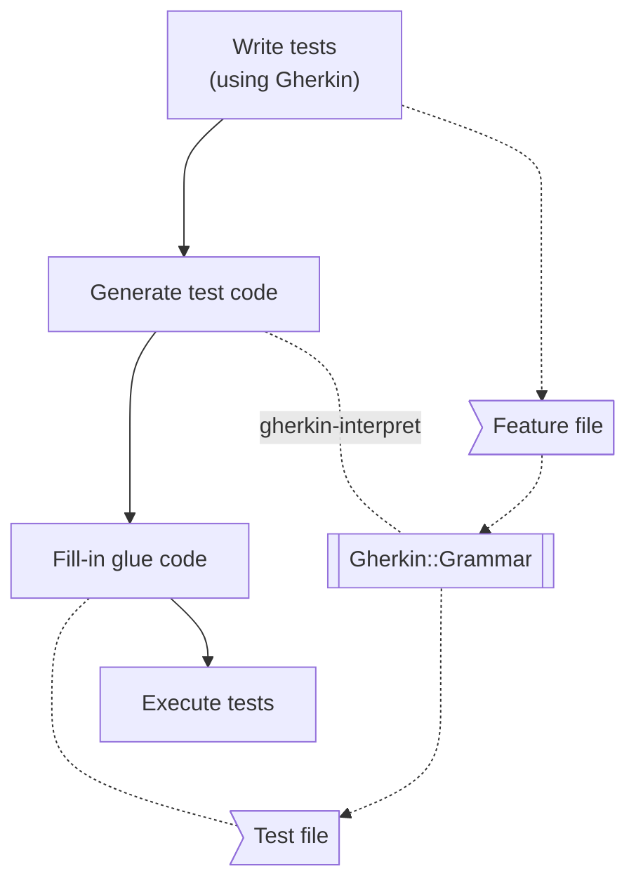

# Gherkin::Grammar Raku package

This repository has the Raku package for
[Gherkin](https://en.wikipedia.org/wiki/Cucumber_(software)#Gherkin_language)
test specifications parsing and interpretations.

[Gherkin](https://en.wikipedia.org/wiki/Cucumber_(software)#Gherkin_language)
is the language of the
[Cucumber framework](https://cucumber.io), [Wk1], that is used to do
[Behavior-Driven Development (BDD)](https://en.wikipedia.org/wiki/Behavior-driven_development), [Wk2].

The Raku package
["Cucumis Sextus](https://github.com/robertlemmen/raku-cucumis-sextus), [RL1], aims to provide a "full-blown"
specification-and-execution framework in Raku like the typical Cucumber functionalities in other languages. (Ruby, Java,
etc.)

This package, "Gherkin::Grammar" takes a minimalist perspective; it aims to provide:

- Grammar (and roles) for parsing Gherkin specifications
- Test file template generation

Having a "standalone" Gherkin grammar (or role) facilitates the creation and execution of general or specialized
frameworks for Raku support of BDD.

The package provides the functions:

- `gherkin-parse`
- `gherkin-subparse`
- `gherkin-interpret`

The Raku outputs of `gherkin-interpret` are test file templates that after filling-in would provide tests that
correspond to the input specifications.

**Remark:** A good introduction to the Cucumber / Gherkin approach and workflows is the
[README](https://github.com/robertlemmen/raku-cucumis-sextus#readme)
of [RLp1].

**Remark:** The grammar in this package was programmed following the specifications and explanations in
[Gherkin Reference](https://cucumber.io/docs/gherkin/reference/).

------

## Installation

From [Zef ecosystem](https://raku.land):

```
zef install Gherkin::Grammar
```

From GitHub:

```
zef install https://github.com/antononcube/Raku-Gherkin-Grammar
```

------

## Workflow

The package follows the *general* Cucumber workflow, but some elements are less automated. Here is a flowchart:



Here is corresponding narration:

1. Write tests using Gherkin specs
2. Generate test code
    - Using the package "Gherkin::Grammar".
3. Fill-in the code of step functions
4. Execute tests
5. Revisit (refine) steps 1 and/or 4 as needed
6. Integrate resulting test file

**Remark:** See the Cucumber framework flowchart in the files
[Flowcharts.md](./docs/Flowcharts.md).

------

## Usage examples

Here is a basic (and short) Gherkin spec interpretation example:

```perl6
use Gherkin::Grammar;

my $text0 = q:to/END/;
Feature: Calculation
    Example: One plus one
    When 1 + 1
    Then 2
END

gherkin-interpret($text0);
```

### Internationalization

The package provides internationalization using different languages. The (initial) internationalization keyword-regexes
data structure was taken from [RLp1].
(See the
file ["I18n.rakumod"](https://github.com/robertlemmen/raku-cucumis-sextus/blob/master/lib/CucumisSextus/I18n.rakumod).)

Here is an example with Russian:

```perl6
my $ru-text = q:to/END/;
Функционал: Вычисление
    Пример: одно плюс одно
    Когда 1 + 1
    Тогда 2
END

gherkin-interpret($ru-text, lang => 'Russian');
```

The Gherkin keywords of different languages can be found with `gherkin-keywords`:

```perl6
use Gherkin::Grammar::Internationalization;

say gherkin-keywords.keys;
say gherkin-keywords.elems;
say gherkin-keywords('en');
say gherkin-keywords('ru');
say gherkin-keywords('ja');
```

### Doc-string Arguments

The package takes both doc-strings and tables as step arguments.

Doc-strings are put between lines with triple quotes; the text between the quotes is given as second argument of the
corresponding step function.

Here is an example of a Gherkin specification for testing a data wrangling Domain Specific Language (DSL)
parser-interpreter, [AA1, AAp2], that uses doc-string:

```gherkin
Feature: Data wrangling DSL pipeline testing

  Scenario: Long pipeline
    Given target is Raku
    And titanic dataset exists
    When is executed the pipeline:
      """
      use @dsTitanic;
      filter by passengerSurvival is "survived";
      cross tabulate passengerSex vs passengerClass
      """
    Then result is a hash
```

That specification is part of the Gherkin file:
["DSL-for-data-wrangling.feature"](./resources/DSL-for-data-wrangling.feature).

The corresponding code generated by "Gherkin::Grammar" is given in the file:
["DSL-for-data-wrangling-generated.rakutest"](./resources/DSL-for-data-wrangling-generated.rakutest).

The fill-in definitions of the corresponding functions are given in the file:
["DSL-for-data-wrangling.rakutest"](./resources/DSL-for-data-wrangling.rakutest).

### Table arguments

The package handles tables as step arguments.
The table arguments are treated differently in
`Example` or `Scenario` blocks than in `Scenario outline` blocks.

Here is a "simple" use of a table:

```gherkin
Feature: DateTime parsing tests

  Scenario: Simple
    When today, yesterday, tomorrow
    Then the results adhere to:
      | Spec      | Result                        |
      | today     | DateTime.today                |
      | yesterday | DateTime.today.earlier(:1day) |
      | tomorrow  | DateTime.today.later(:1day)   |
```

Here is a `Scenario Outline` spec:

```gherkin
Feature: DateTime parsing tests 2

   Scenario Outline: Repeated
      Given <Spec>
      Then <Result>
      Examples: the results adhere to:
         | Spec      | Result                        |
         | today     | DateTime.today                |
         | yesterday | DateTime.today.earlier(:1day) |
         | tomorrow  | DateTime.today.later(:1day)   |
```

**Remark:** The package "Markdown::Grammar", [AAp1], parses tables
in a similar manner, but [AAp1] assumes that a table field can have
plain words, words with slant or weight, or hyperlinks.

**Remark:** The package [AAp1] parses tables with- and without headers.
The Gherkin language descriptions and examples I have seen did not have tables
with header separators. Hence, a header separator is treated as a regular 
table row in "Gherkin::Grammar".


------

## Complete examples

### Calculator

The files
["Calculator.feature"](./resources/Calculator.feature)
and
["Calculator.rakutest"](./resources/Calculator.rakutest)
provide a simple, fully worked example of how this package can be used to implement Cucumber framework workflows.

**Remark:** The Cucumber framework(s) expect Gherkin test specifications to be written in files 
with extension ".feature".

### DateTime interpretation

The date-time interpretations of the package "DateTime::Grammar", [AAp3], are tested with the feature file
[DateTime-interpretation.feature](./resources/DateTime-interpretation.feature) 
(and the related "*.rakutest" files.)

### Numeric word forms parsing

The interpretations of numeric word forms into number of the package "Lingua::NumericWordForms", [AAp4],
are tested with the feature file
[Numeric-word-forms-parsing.feature](./resources/Numeric-word-forms-parsing.feature)
(and the related "*.rakutest" files.)

### DSL for data wrangling

The data wrangling translations and execution results of the package 
"DSL::English::DataQueryWorkflows", [AA1, AAp2], are tested with the feature file
[DSL-for-data-wrangling.feature](./resources/DSL-for-data-wrangling.feature)
(and the related "*.rakutest" files.)

This is a fairly non-trivial examples that involves multiple packages.
Also, it makes a lot of sense to test DSL translators using a testing DSL 
(like Gherkin.)

------

## CLI

The package provides a Command Line Interface (CLI) script. Here is its help message:

```shell
gherkin-interpretation --help
```

------

## References

### Articles

[AA1] Anton Antonov,
["Introduction to data wrangling with Raku"](https://rakuforprediction.wordpress.com/2021/12/31/introduction-to-data-wrangling-with-raku/)
,
(2021),
[RakuForPrediction at WordPress](https://rakuforprediction.wordpress.com).

[SB1] SmartBear,
["Gherkin Reference"](https://cucumber.io/docs/gherkin/reference/),
(2023),
[cucumber.io](https://cucumber.io).

[Wk1] Wikipedia entry,
["Cucumber (software)"](https://en.wikipedia.org/wiki/Cucumber_(software)). See also [cucumber.io](https://cucumber.io).

[Wk2] Wikipedia entry,
["Behavior-driven development"](https://en.wikipedia.org/wiki/Behavior-driven_development).

### Packages

[AAp1] Anton Antonov,
[Markdown::Grammar Raku package](https://github.com/antononcube/Raku-Markdown-Grammar),
(2022-2023),
[GitHub/antononcube](https://github.com/antononcube).

[AAp2] Anton Antonov,
[DSL::English::DataQueryWorkflows Raku package](https://github.com/antononcube/Raku-DSL-English-DataQueryWorkflows),
(2021-2023),
[GitHub/antononcube](https://github.com/antononcube).

[AAp3] Anton Antonov,
[DateTime::Grammar Raku package](https://github.com/antononcube/Raku-DateTime-Grammar),
(2023),
[GitHub/antononcube](https://github.com/antononcube).

[AAp4] Anton Antonov,
[Lingua::NumericWordForms Raku package](https://github.com/antononcube/Raku-Lingua-NumericWordForms),
(2021-2023),
[GitHub/antononcube](https://github.com/antononcube).

[RLp1] Robert Lemmen,
[Cucumis Sextus Raku package](https://github.com/robertlemmen/raku-cucumis-sextus),
(2017-2020),
[GitHub/robertlemmen](https://github.com/robertlemmen).
