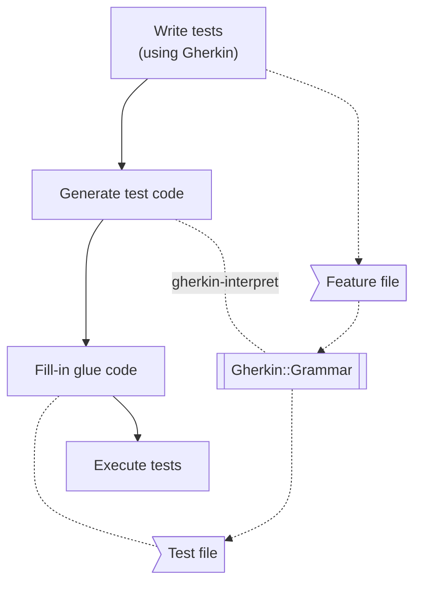
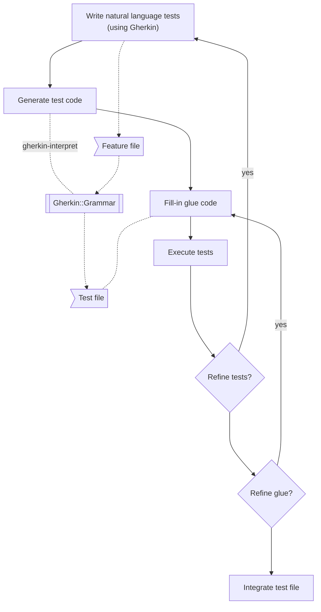

# Flowcharts

------

## Simple workflow

```mermaid
flowchart TD
    WT["Write tests<br/>(using Gherkin)"] 
    FG[Fill-in glue code]
    GTC[Generate test code]
    ET[Execute tests]
    FF>Feature file]
    GG[[Gherkin::Grammar]]
    TF>Test file]
    WT ---> GTC ---> FG
    WT -..-> FF
    GTC -..- |gherkin-interpret|GG
    FF -.-> GG
    GG -..->  TF
    FG -..- TF
    FG --> ET
```

------

## Fuller workflow

```mermaid
flowchart TD
    WT["Write natural language tests<br/>(using Gherkin)"] 
    FG[Fill-in glue code]
    GTC[Generate test code]
    ET[Execute tests]
    FF>Feature file]
    GG[[Gherkin::Grammar]]
    TF>Test file]
    RTQ{Refine tests?}
    RGQ{Refine glue?}
    END[Integrate test file]
    WT ---> GTC ---> FG
    WT -..-> FF
    GTC -..- |gherkin-interpret|GG
    FF -.-> GG
    GG -..->  TF
    FG -..- TF
    FG --> ET
    ET ---> RTQ
    RTQ ---> |yes|WT
    RTQ ---> RGQ
    RGQ ---> |yes|FG
    RGQ ---> END
```